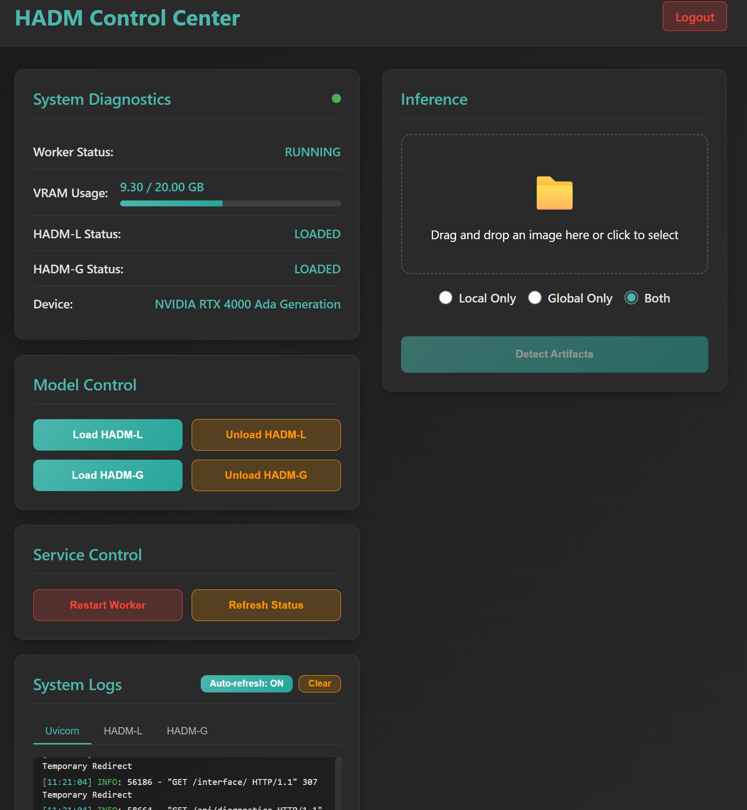
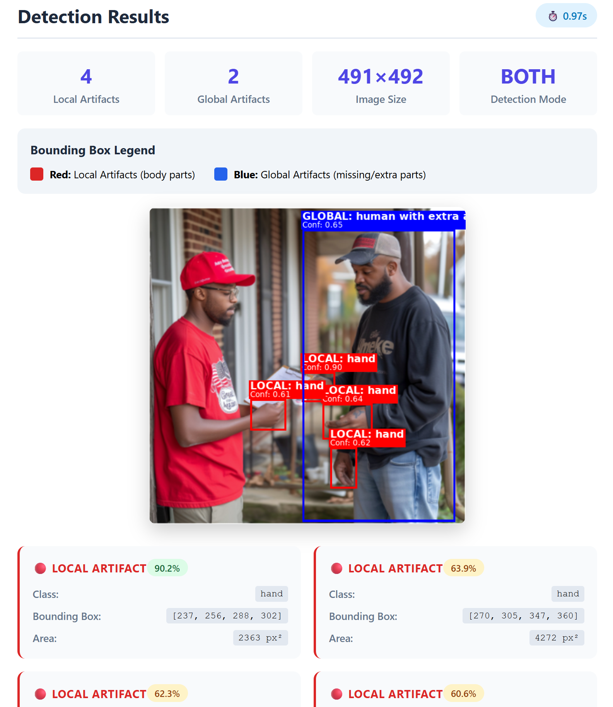

# HADM Server - Human Artifact Detection Models

> **Credits**: This server implementation is based on the original HADM (Human Artifact Detection Models) work by Wang et al. All model architectures, training methodologies, and detection algorithms are credited to the original authors.
>
> **Original Repository**: https://github.com/wangkaihong/HADM  
> **Paper**: Wang, Kaihong, Zhang, Lingzhi, and Zhang, Jianming. "Detecting Human Artifacts from Text-to-Image Models." arXiv preprint arXiv:2411.13842 (2024). https://arxiv.org/abs/2411.13842
>
> This implementation provides a production-ready FastAPI server wrapper around the original HADM models with web dashboard and REST API endpoints.

## Overview

A unified FastAPI server that provides both web dashboard and REST API endpoints for detecting AI-generated artifacts in images using HADM-L (Local) and HADM-G (Global) models.

### Features

- **Unified Architecture**: Single server process with web dashboard and API endpoints
- **Lazy Loading**: Models load on-demand to avoid CUDA multiprocessing issues
- **Web Dashboard**: Interactive interface for model management and image analysis
- **REST API**: Programmatic access with both Basic Auth and API key authentication
- **Real-time Monitoring**: VRAM usage, model status, and system diagnostics
- **Flexible Authentication**: Environment-based credentials and API keys
- **Docker Support**: Complete containerization with GPU support
- **Comprehensive Logging**: Detailed system and inference logs

### Screenshots

| Feature | Screenshot |
|---------|------------|
| **Control Dashboard** |  |
| **Detection Results** |  |
| **API Documentation** | Available at `/docs` (Swagger UI style) |

## Quick Start

### 1. Environment Setup

Copy the example environment file and configure your credentials:

```bash
cp .env_example .env
```

Edit `.env` with your preferred credentials:

```bash
# Authentication credentials
ADMIN_USERNAME=intelligents
ADMIN_PASSWORD=intelligentsintelligents

# API Key for secure API access (generate a new one for production)
API_KEY=hadm_7k9m2n4p8q1r5s3t6v9w2x5z8a1b4c7e

# Server configuration
SERVER_HOST=0.0.0.0
SERVER_PORT=8080

# Model paths
HADM_L_MODEL_PATH=pretrained_models/HADM-L_0249999.pth
HADM_G_MODEL_PATH=pretrained_models/HADM-G_0249999.pth
EVA02_BACKBONE_PATH=pretrained_models/eva02_L_coco_det_sys_o365.pth

# Logging
LOG_LEVEL=INFO
```

**Important**: Change the default credentials and API key before deploying to production!

### 2. Download Models

Download the pre-trained models from the original HADM repository and place them in the `pretrained_models/` directory:

- **HADM-L**: `HADM-L_0249999.pth` - Local artifact detection model
- **HADM-G**: `HADM-G_0249999.pth` - Global artifact detection model  
- **EVA-02 Backbone**: `eva02_L_coco_det_sys_o365.pth` - Backbone model

> **Note**: Model download links are available in the original HADM repository: https://github.com/wangkaihong/HADM

### 3. Start Server

The `start_server.sh` script handles everything - environment setup, dependency installation, model downloads, and server startup:

```bash
# Make the script executable
chmod +x start_server.sh

# Start in lazy mode (recommended - models load on demand)
./start_server.sh --lazy

# Or start with models pre-loaded
./start_server.sh start

# First-time setup (automatic system dependency installation)
./start_server.sh setup
```

### 4. Access the Application

- **Web Dashboard**: http://localhost:8080/dashboard
- **Simple Interface**: http://localhost:8080/interface  
- **API Documentation**: http://localhost:8080/docs (Interactive Swagger UI)
- **Login**: Use credentials from your `.env` file (default: intelligents/intelligentsintelligents)

## Usage

### Web Interface

1. Navigate to http://localhost:8080
2. Login with your credentials from `.env`
3. Choose between:
   - **Dashboard**: Advanced control panel with real-time monitoring
   - **Interface**: Simple upload and detection interface
4. Load models using the control buttons
5. Upload images for artifact detection

### REST API

#### Quick Test Example

Once your server is running, test it with a sample image:

```bash
# Test with the example API key from .env_example
curl -X POST \
  -H "X-API-Key: hadm_7k9m2n4p8q1r5s3t6v9w2x5z8a1b4c7e" \
  -F "file=@artifacts.png" \
  -F "mode=both" \
  http://localhost:8080/api/v1/detect
```

#### API Key Authentication (Recommended)

The API key from your `.env` file is used for all programmatic access:

```bash
# Using query parameter
curl -X POST \
  -F "file=@image.jpg" \
  -F "mode=both" \
  "http://localhost:8080/api/v1/detect?api_key=your_api_key_here"

# Using header
curl -X POST \
  -H "X-API-Key: your_api_key" \
  -F "file=@image.jpg" \
  -F "mode=both" \
  http://localhost:8080/api/v1/detect

# Using Authorization Bearer
curl -X POST \
  -H "Authorization: Bearer your_api_key" \
  -F "file=@image.jpg" \
  -F "mode=both" \
  http://localhost:8080/api/v1/detect
```

#### Basic Authentication (Alternative)

```bash
curl -u intelligents:intelligentsintelligents \
  -X POST \
  -F "file=@image.jpg" \
  -F "mode=both" \
  http://localhost:8080/api/detect
```

### Model Management

#### Load Models
```bash
# Load HADM-L model
curl -H "X-API-Key: your_api_key" -X POST http://localhost:8080/api/control/load_l

# Load HADM-G model  
curl -H "X-API-Key: your_api_key" -X POST http://localhost:8080/api/control/load_g
```

#### Check Status
```bash
curl -H "X-API-Key: your_api_key" http://localhost:8080/api/diagnostics
```

## Server Management

### Complete Server Control

The `start_server.sh` script provides comprehensive server management:

```bash
# Start server with lazy loading (recommended)
./start_server.sh --lazy

# Start with pre-loaded models
./start_server.sh start

# Restart server
./start_server.sh restart

# Restart in lazy mode
./start_server.sh restart-lazy

# Stop server
./start_server.sh stop

# Check status
./start_server.sh status

# View logs (default: 50 lines)
./start_server.sh logs [lines]

# View system setup logs
./start_server.sh setup-logs [lines]

# Force clean all processes and ports
./start_server.sh force-clean

# Run system setup only
./start_server.sh setup

# Reset setup flag to force re-run
./start_server.sh reset-setup
```

### Enhanced Features

- **Automatic System Setup**: Installs all dependencies on first run
- **Sudo Elevation**: Attempts sudo for system packages, continues without if failed
- **Process Management**: Always stops existing services before starting
- **Port Cleanup**: Force kills any processes using the server port
- **Enhanced Logging**: Detailed startup and operation logs
- **Smart Startup**: Detects and handles various startup scenarios

## Configuration

### Environment Variables

| Variable | Default | Description |
|----------|---------|-------------|
| `ADMIN_USERNAME` | intelligents | Web dashboard username |
| `ADMIN_PASSWORD` | intelligentsintelligents | Web dashboard password |
| `API_KEY` | (random) | API key for programmatic access |
| `SERVER_HOST` | 0.0.0.0 | Server bind address |
| `SERVER_PORT` | 8080 | Server port |
| `HADM_L_MODEL_PATH` | pretrained_models/HADM-L_0249999.pth | Local model path |
| `HADM_G_MODEL_PATH` | pretrained_models/HADM-G_0249999.pth | Global model path |
| `EVA02_BACKBONE_PATH` | pretrained_models/eva02_L_coco_det_sys_o365.pth | Backbone path |
| `LOG_LEVEL` | INFO | Logging level |

### Detection Modes

Based on the original HADM paper methodology:

- **`local`**: Detect local artifacts (body parts: face, torso, arm, leg, hand, feet)
- **`global`**: Detect global artifacts (missing/extra body parts)
- **`both`**: Run both local and global detection (recommended)

### Model Operations

- **Load Models**: Use dashboard buttons or API endpoints
- **Unload Models**: Individual model unloading or "Unload All Models" button
- **Monitor VRAM**: Real-time usage via nvidia-smi integration
- **Check Status**: System diagnostics and model states

## API Endpoints

### Authentication Endpoints
- `GET /` - Redirect to interface (if authenticated) or login
- `GET /login` - Login page
- `POST /login` - Handle login form submission
- `GET /dashboard` - Advanced dashboard (requires auth)
- `GET /interface` - Simple interface (requires auth)

### Detection Endpoints
- `POST /api/detect` - Detect artifacts (Basic Auth)
- `POST /api/v1/detect` - Detect artifacts (API Key) - **Recommended**
- `POST /interface/detect` - Web form detection (Cookie Auth)

### Management Endpoints
- `GET /api/diagnostics` - System status and VRAM usage (API Key)
- `POST /api/control/{command}` - Model control: load_l, unload_l, load_g, unload_g (API Key)
- `GET /api/logs` - System logs with filtering (API Key)
- `GET /models/status` - Model loading status (API Key)
- `GET /health` - Health check (No auth)

### API Documentation
- `GET /docs` - Interactive Swagger UI for API testing
- `GET /redoc` - Alternative API documentation

## Architecture

### Unified Design
- **Single Process**: No separate workers, eliminates CUDA multiprocessing issues
- **Lazy Loading**: Heavy ML imports and models load on-demand
- **Thread Safe**: Model loading/unloading with proper locking
- **Real-time Monitoring**: Live VRAM and status updates via nvidia-smi

### Security Features
- **API Key Verification**: All programmatic endpoints require API key from `.env`
- **Multiple Auth Methods**: Query parameter, header, or Bearer token
- **Cookie Authentication**: Web interface uses secure session cookies
- **Environment-based Config**: All secrets stored in `.env` file

### Model Pipeline
1. **Image Preprocessing**: RGB→BGR conversion, resizing to 1024x1024
2. **HADM-L Detection**: Local artifact detection (body parts)
3. **HADM-G Detection**: Global artifact detection (missing/extra parts)
4. **Post-processing**: Bounding box drawing, confidence scoring
5. **Results**: JSON response with detections and metadata

## Docker Support

### Building and Running

```bash
# Build the Docker image
docker build -t hadm-server .

# Run with GPU support
docker run --gpus all -p 8080:8080 -v ./pretrained_models:/app/pretrained_models hadm-server

# Run with docker-compose
docker-compose up -d
```

### Docker Configuration

The Docker setup includes:
- **GPU Support**: NVIDIA runtime for CUDA acceleration
- **Volume Mounting**: For model files and logs
- **Environment Variables**: Configurable via `.env` file
- **Health Checks**: Automatic container health monitoring

## Troubleshooting

### Common Issues

1. **Models not loading**: 
   - Check file paths in `.env` and ensure models exist in `pretrained_models/`
   - Verify GPU memory availability
   - Check logs: `./start_server.sh logs`

2. **CUDA errors**: 
   - Use lazy mode: `./start_server.sh --lazy`
   - Check GPU drivers and CUDA installation
   - Monitor VRAM usage in dashboard

3. **Authentication failed**: 
   - Verify credentials in `.env` file
   - Check API key format and usage
   - Clear browser cookies if needed

4. **Port conflicts**: 
   - Change `SERVER_PORT` in `.env`
   - Use force clean: `./start_server.sh force-clean`

5. **VRAM issues**: 
   - Use "Unload All Models" to free memory
   - Monitor usage in real-time via dashboard
   - Consider using smaller batch sizes

### Logs and Debugging

```bash
# View recent server logs
./start_server.sh logs 100

# View system setup logs
./start_server.sh setup-logs 50

# Check server status
./start_server.sh status

# Test health endpoint
curl http://localhost:8080/health

# Test API with verbose output
curl -v -H "X-API-Key: your_api_key" http://localhost:8080/api/diagnostics
```

### Performance Optimization

- **Lazy Mode**: Start with `--lazy` for faster startup
- **Model Preloading**: Use `start` for immediate inference capability
- **VRAM Management**: Monitor and unload unused models
- **Batch Processing**: Process multiple images in sequence for efficiency

## Security Notes

- **Change default credentials** in `.env` before production use
- **Generate new API key** for production deployments  
- **Use HTTPS** in production environments
- **Restrict network access** to authorized users only
- **Regularly rotate** API keys and passwords
- **Monitor access logs** for suspicious activity

## Requirements

### System Requirements
- **OS**: Linux (Ubuntu 20.04+ recommended)
- **Python**: 3.8+
- **GPU**: NVIDIA GPU with 8GB+ VRAM (recommended)
- **RAM**: 16GB+ system RAM
- **Storage**: 10GB+ free space for models

### Software Dependencies
- PyTorch with CUDA support
- Detectron2
- FastAPI and dependencies
- OpenCV
- PIL/Pillow
- NumPy

### Hardware Recommendations
- **GPU**: RTX 3080/4080 or better
- **VRAM**: 12GB+ for both models loaded simultaneously
- **CPU**: Multi-core processor for preprocessing
- **Storage**: SSD for faster model loading

## Citation

If you use this server implementation, please cite the original HADM paper:

```bibtex
@article{Wang2024HADM,
  title={Detecting Human Artifacts from Text-to-Image Models},
  author={Wang, Kaihong and Zhang, Lingzhi and Zhang, Jianming},
  journal={arXiv preprint arXiv:2411.13842},
  year={2024}
}
```

## Acknowledgments

- **Original HADM Models**: Wang, Kaihong, Zhang, Lingzhi, and Zhang, Jianming
- **Original Repository**: https://github.com/wangkaihong/HADM
- **Paper**: https://arxiv.org/abs/2411.13842
- **Base Framework**: Built on Detectron2 and EVA-02
- **FastAPI**: Modern Python web framework
- **NVIDIA**: CUDA and GPU acceleration support

## License

This server implementation is provided as-is. Please refer to the original HADM model licenses and terms of use from the original repository: https://github.com/wangkaihong/HADM

---

## Support

For issues related to:
- **Server Implementation**: Open an issue in this repository
- **Original HADM Models**: Refer to the original repository
- **Detectron2**: Check the Detectron2 documentation
- **CUDA/GPU Issues**: Consult NVIDIA documentation

**Access Points:**
- Web Dashboard: http://localhost:8080/dashboard
- API Documentation: http://localhost:8080/docs
- Simple Interface: http://localhost:8080/interface
- Default Login: intelligents / intelligentsintelligents
